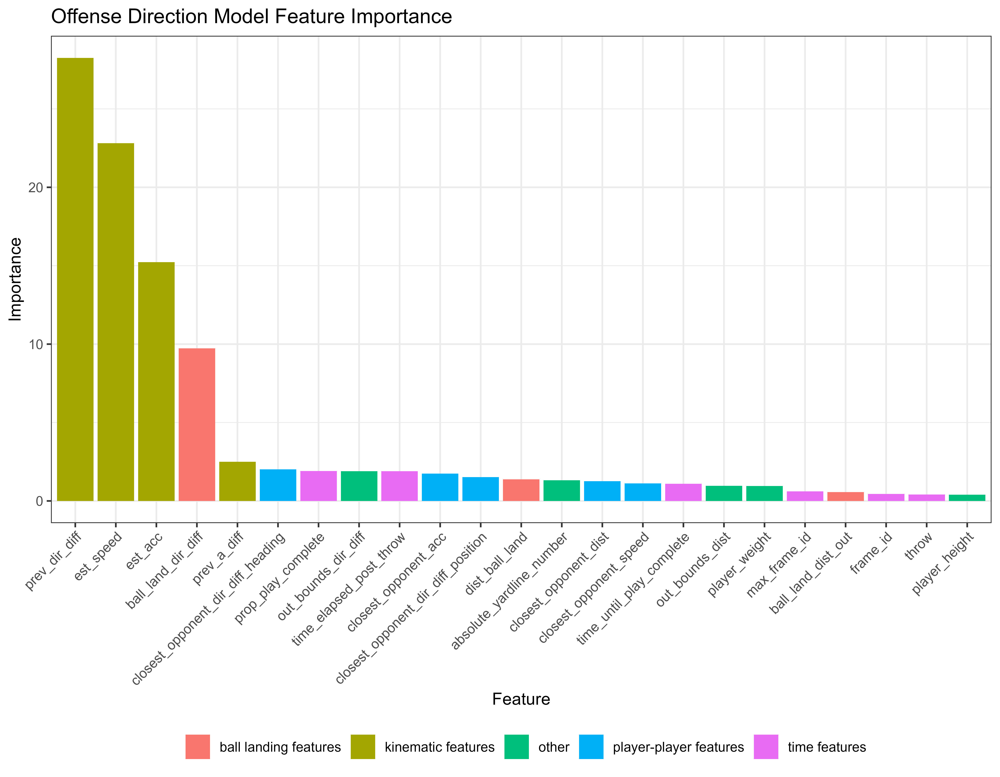
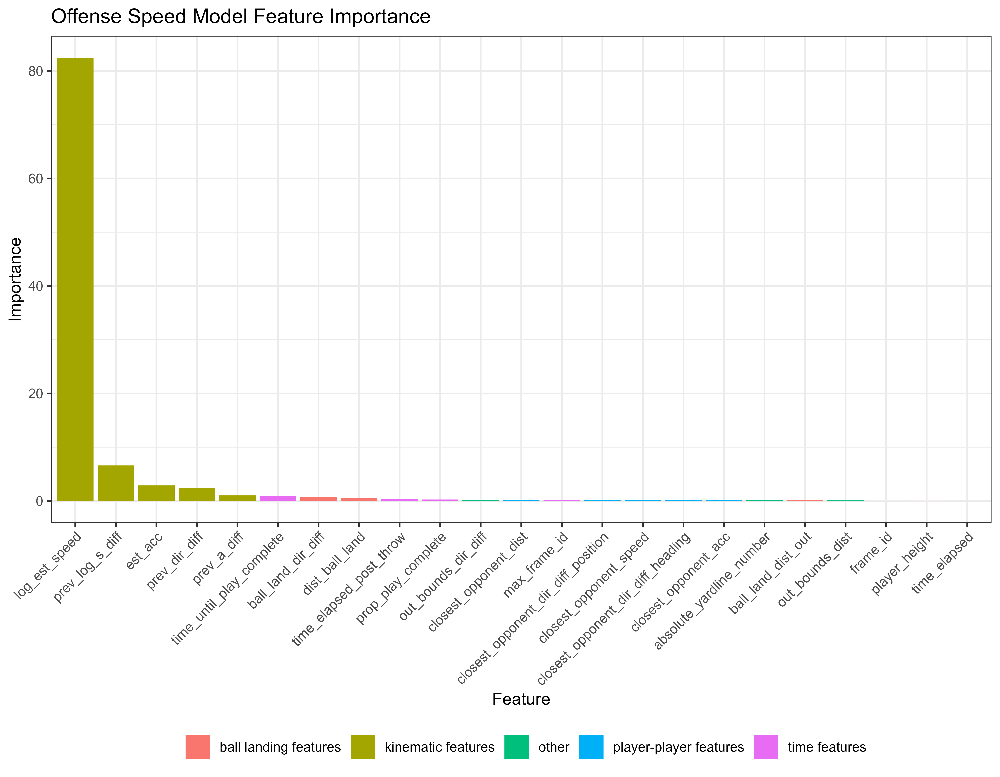

# NFL Big Data Bowl 2026 - Prediction

## Overview

- Goal is to predict player movement after the ball is thrown using NFL player tracking data. Full information can be found on [kaggle](https://www.kaggle.com/competitions/nfl-big-data-bowl-2026-prediction/overview).
- Repo contains full data pipeline that cleans player tracking data, derives important features, and trains and generates predictions from six CatBoost models in parallel in 5-fold CV.

## Data

- Over 5 million frames across 14,108 plays in the 2023-2024 NFL season. 
- On each play, the players to predict were the targeted receiver and any defensive player within 5 yards of the target receiver at throw, or is able to reach the ball landing location.

## Modelling Approach

- Six total models that predict the proceeding frame's direction difference, speed, and acceleration for offensive and defensive players separately.
- Contrasts most other approaches which predicted the future x,y positions. I figured updating the position based on direction, speed, and acceleration is universal across the entire field whereas predicting x,y might depend on the current field position. 
- Used [CatBoost](https://catboost.ai/) since it provides quick accurate predictions with little tuning (biggest advantage since the data is so large).
- Speed model predicted future log(speed) and back-transformed to the original scale, since speeds are strictly positive. 
- Data cleaned to remove impossible speeds and accelerations or plays that were left recording too long. 
- Models trained on all the frames where the ball was in the air, or frames before the ball is thrown but the play is 62.5% overall complete. Initial 62.5% of frames in the play were not used to train the models. This cutoff was tuned through CV.

## Feature Engineering
Features list:
- **kinematics**: current and lagged difference in direction, speed, log(speed), acceleration. 
- **time features**: time until play complete, time elapsed, time elapsed post-throw, frame_id, frame_id of throw.
- **player-player features**: closest opponent and closest teammate distance, difference in direction to each other, difference in direction to ball, speed, acceleration.
- **ball landing point features**: distance to ball landing point, difference in direction to ball landing point, ball landing point distance to out of bounds.
- **other**: distance to out of bounds, difference in direction to nearest out of bounds, player height, player weight, absolute yardline number.

Each model used a different combination of these features (eg, speed model used current log(speed) instead of current speed).

  
  

## Results
- Final results TBA. They are scored on the remaining games in the 2025-2026 regular season.
- Training data CV rmse around 0.77.
- These are accurate predictions. Average error of player movement when ball is in the air is roughly equivalent to 2.5 times the length of a football.

  
  

  <em>Predicted vs true position when ball is in the air for two sample plays.</em>

## Key Lessons
- Defense harder to predict than offense. Offense almost always go straight ball landing point but defense may be guarding other players.
- Predominantly important features were kinematics, especially in speed, acceleration models. Then ball landing point features, then various time features. Surprisingly, the player-player features did not seem to help much.
- Parallelizing CV over fold and plays was crucial for efficient training and tuning.
- Creating basic helper functions like calculating direction differences made my life so much easier.
- Probably spent too much time on feature engineering, should have prioritized model architecture a bit more.

## Future Improvements
- Implement a deep learning approach with CNNs.
- Ensemble with other models (XGBoost, Light GBM, CNNs, ...).
- Embedding players would allow model to learn more player-specific info.
  

